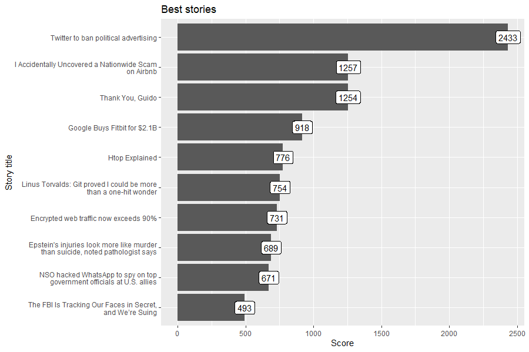
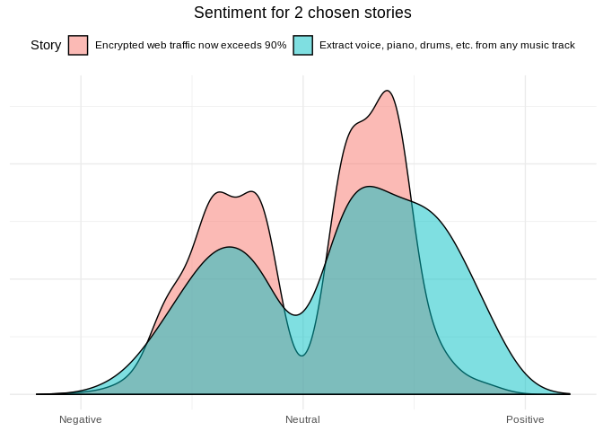

<!-- README.md is generated from README.Rmd. Please edit that file -->

```{r, include = FALSE}
knitr::opts_chunk$set(
  collapse = TRUE,
  comment = "#>",
  fig.path = "man/figures/README-"
  # out.width = "100%"
)
```

# hackeRnews 

<!-- badges: start -->
[](https://travis-ci.com/szymanskir/hackeRnews)
[](https://ci.appveyor.com/project/szymanskir/hackeRnews)
[](https://codecov.io/gh/szymanskir/hackeRnews?branch=master)
[](https://CRAN.R-project.org/package=hackeRnews)
[](https://CRAN.R-project.org/package=hackeRnews)
<!-- badges: end -->


The `hackeRnews` package was created in order to simplify the process of getting data from [Hacker News](https://news.ycombinator.com/news). Hacker News is a social news website focusing on computer science. It is composed of user submitted stories where each one provides a link to the original data source. Moreover, users have the ability to upvote a story if they have found it interesting and discuss the topic in the comment section with others. Besides news stories Hacker News contains the following sections:

- 'Ask' section where users can ask questions to the Hacker News community
- 'Show' section where users can share something that they have created
- 'Jobs' section where users can browse job offers

In this document basic usage of the `hackeRnews` package will be presented along with some example use cases.

## Endpoint wrappers

The `hackeRnews` package provides user friendly wrappers around the [Official Hacker News API](https://github.com/HackerNews/API). Specific endpoints along with corresponding functions and their descriptions are presented in the table below:

| Endpoint            	| `hackeRnews` function                       	| Description                                                    	|
|---------------------	|---------------------------------------------	|----------------------------------------------------------------	|
| /v0/item/<id>       	| `get_item_by_id(id=<id>)`                   	| Retrieves the item corresponding to specified id               	|
| /v0/user/<username> 	| `get_user_by_username(username=<username>)` 	| Retrieves the user corresponding to the specified username     	|
| /v0/maxitem         	| `get_max_item_id()`                         	| Retrieves to the id of the latest published item               	|
| /v0/topstories      	| `get_top_stories_ids()`                     	| Retrieves the ids of the current top stories                   	|
| /v0/newstories      	| `get_new_stories_ids()`                     	| Retrieves the ids of current new stories                       	|
| /v0/beststories     	| `get_best_stories_ids()`                    	| Retrieves the ids of best new stories                          	|
| /v0/askstories      	| `get_latest_ask_stories_ids()`              	| Retrieves the ids of latest *ask* stories                      	|
| /v0/showstories     	| `get_latest_show_stories_ids()`             	| Retrieves the ids of latest *show* stories                     	|
| /v0/jobstories      	| `get_latest_job_stories_ids()`              	| Retrieves the ids of latest *job* stories                      	|
| /v0/updates         	| `get_updates()`                             	| Retrieves the ids of the items and usernames that were updated 	|

The package does not only contain wrappers for the API endpoints but it also provides some additional functions that simplify some operations. For example instead of retrieving the ids of top stories with the `get_top_stories_ids()` and then looping over the vector retrieving each item one by one using the `get_item_by_id(id=<id>)` function, the user can just use the `get_top_stories()` function. Moreover, `hackeRnews` makes use of the [`future.apply`](https://github.com/HenrikBengtsson/future.apply) package to speed collecting multiple items by fetching them in parallel as collecting 500 stories sequentially might take a long time.

## Use cases
Before proceeding to the use cases the installation and setup of the package will be described. `hackeRnews`is available on CRAN and can be installed using the following command:
```r
install.package("hackeRnews")
```

Next, in order to configure `hackeRnews` to fetch data in parallel, we will setup *multiprocess* futures:
```{r warning=FALSE}
library(hackeRnews)
future::plan(future::multiprocess) # setup multiprocess futures, read more at https://github.com/HenrikBengtsson/future
```

The hackeRnews package is an R wrapper for the Hacker News API. Project for Advanced R classes at the Warsaw University of Technology.

## Installation and basic setup

The `hackeRnews` package is vailable on CRAN and can be installed with:
```r
install.packages("hackeRnews")
```

You can install the development version from [GitHub](https://github.com/) with:

``` r
# install.packages("devtools")
devtools::install_github("szymanskir/hackeRnews")
```

The Hacker News API is constructed in such a way that a single item is retrieved with a single request. This means that the retrieval of 200 items requires 200 separate API calls. Processing this amount of requests sequentially takes a significant amount of time. In order to solve this issue the `hackeRnews` package makes use of the `future.apply` package (https://github.com/HenrikBengtsson/future.apply) which allows to fetch all of the requested items in parallel. However, this requires some additional setup:

```r
library(hackeRnews)
future::plan(future::multiprocess) # setup multiprocess futures, read more at https://github.com/HenrikBengtsson/future
```

## Cheatsheet

<a href="https://github.com/szymanskir/hackeRnews/blob/master/cheatsheet/cheatsheet.pdf"></a>  

## Examples

### Identify buzzwords in job offers of Hacker News

This example will show how to get recently used words in job story titles. Words will be visualized using word cloud to show which words were used the most.

```{r, warning=FALSE, message=FALSE, eval=FALSE}
library(hackeRnews)
library(tidyverse)
library(tidytext)
library(stringr)
library(dplyr)
library(ggwordcloud)

job_stories <- hackeRnews::get_latest_job_stories()

# get titles, normalize used words, remove non alphabet characters
title_words <- unlist(
  lapply(job_stories, FUN=function(job_story) { job_story$title }) %>% 
  str_replace_all('[^A-Z|a-z]', ' ') %>% 
  str_to_upper() %>% 
  str_replace_all('\\s\\s*', ' ') %>% 
  str_split(' ')
)

# remove stop words
data('stop_words')
df <- data.frame(word=title_words, stringsAsFactors=FALSE) %>% 
  filter(str_length(word) > 0 & !str_to_lower(word) %in% stop_words$word) %>% 
  count(word)

# add some random colors to beautify visualization
df <- as.data.frame(df) %>% 
  mutate(color=factor(sample(10,nrow(df), replace=TRUE)))


word_cloud <- ggplot(df, aes(label=word, size=n, color=color)) + 
  geom_text_wordcloud() + 
  scale_size_area(max_size = 15)

```


### Check what's trending on Hacker News

This example will fetch best stories and plot titles of most recently trending stories.

```{r, warning=FALSE, message=FALSE, eval=FALSE}
library(hackeRnews)
library(stringr)
library(ggplot2)

best_stories <- hackeRnews::get_best_stories(max_items=10)
df <- data.frame(
  title=unlist(lapply(best_stories, FUN=function(best_story) { str_wrap(best_story$title, 42) })),
  score=unlist(lapply(best_stories, FUN=function(best_story) { best_story$score })),
  stringsAsFactors=FALSE
)

df$title = factor(df$title, levels=df$title[order(df$score)])

best_stories_plot <- ggplot(df, aes(x = title, y = score, label=score)) +
  geom_col() +
  geom_label() +
  coord_flip() +
  xlab('Story title') +
  ylab('Score') +
  ggtitle('Best stories')

```



### Sentiment analysis on two best stories from Hacker News

```{r, warning=FALSE, message=FALSE, eval=FALSE}
library(hackeRnews)
library(tidyverse)
library(tidytext)
library(dplyr)

best_stories <- hackeRnews::get_best_stories(2)

comments_by_story <- lapply(best_stories,
                   function(story){
                     get_comments(story)$text
                   }
)

# normalize used words, remove non alphabet characters
words_by_story <- lapply(comments_by_story,
                        function(comments){
                            unlist(
                            comments %>%
                              str_replace_all('[^A-Z|a-z]', ' ') %>%
                              str_to_lower() %>%
                              str_replace_all('\\s\\s*', ' ') %>%
                              str_split(' ')
                          )
                        }
)

# remove stop words and empty strings
data('stop_words')
dataframes <- lapply(1:length(words_by_story), function(story_id){
  data.frame(word=words_by_story[[story_id]], stringsAsFactors=FALSE, story_id=story_id) %>%
    filter(!word %in% stop_words$word & word != "")
  }
)

df <- bind_rows(dataframes)

# get sentiment for every story
library(textdata)
sentiment <- get_sentiments("afinn")

df %>%
  inner_join(sentiment, by='word') %>%
  mutate(story_title=sapply(story_id, function(id){best_stories[[id]]$title}) ) %>% 
  ggplot(aes(x=value, fill=as.factor(story_title))) +
    geom_density(alpha=0.5) +
    scale_x_continuous(breaks=c(-5, 0, 5),
                       labels=c("Negative", "Neutral", "Positive"),
                       limits=c(-6, 6)) +
    theme_minimal() +
    theme(axis.title.x=element_blank(),
          axis.title.y=element_blank(),
          axis.text.y=element_blank(),
          axis.ticks.y=element_blank(),
          plot.title=element_text(hjust=0.5),
          legend.position = 'top') +
    labs(fill='Story') +
    ggtitle('Sentiment for 2 chosen stories')
```


