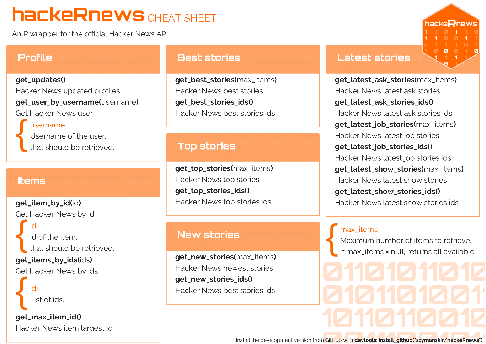

<!-- README.md is generated from README.Rmd. Please edit that file -->

# hackeRnews 

<!-- badges: start -->

[](https://travis-ci.com/szymanskir/hackeRnews)
[](https://ci.appveyor.com/project/szymanskir/hackeRnews)
[](https://codecov.io/gh/szymanskir/hackeRnews?branch=master)
<!-- badges: end -->

The hackeRnews package is an R wrapper for the Hacker News API. Project
for Advanced R classes at the Warsaw University of Technology.

## Installation and basic setup

You can install the development version from
[GitHub](https://github.com/) with:

``` r
# install.packages("devtools")
devtools::install_github("szymanskir/hackeRnews")
```

The Hacker News API is constructed in such a way that a single item is
retrieved with a single request. This means that the retrieval of 200
items requires 200 separate API calls. Processing this amount of
requests sequentially takes a significant amount of time. In order to
solve this issue the `hackeRnews` package makes use of the
`future.apply` package
(<https://github.com/HenrikBengtsson/future.apply>) which allows to
fetch all of the requested items in parallel. However, this requires
some additional setup:

``` r
library(hackeRnews)
future::plan(future::multiprocess) # setup multiprocess futures, read more at https://github.com/HenrikBengtsson/future
```

## Cheatsheet

<a href="https://github.com/szymanskir/hackeRnews/blob/master/cheatsheet/cheatsheet.pdf"></a>

## Examples

### Identify buzzwords in job offers of Hacker News

This example will show how to get recently used words in job story
titles. Words will be visualized using word cloud to show which words
were used the most.

``` r
library(hackeRnews)
library(tidyverse)
library(tidytext)
library(stringr)
library(dplyr)
library(ggwordcloud)

job_stories <- hackeRnews::get_latest_job_stories()

# get titles, normalize used words, remove non alphabet characters
title_words <- unlist(
  lapply(job_stories, FUN=function(job_story) { job_story$title }) %>% 
  str_replace_all('[^A-Z|a-z]', ' ') %>% 
  str_to_upper() %>% 
  str_replace_all('\\s\\s*', ' ') %>% 
  str_split(' ')
)

# remove stop words
data('stop_words')
df <- data.frame(word=title_words, stringsAsFactors=FALSE) %>% 
  filter(str_length(word) > 0 & !str_to_lower(word) %in% stop_words$word) %>% 
  count(word)

# add some random colors to beautify visualization
df <- as.data.frame(df) %>% 
  mutate(color=factor(sample(10,nrow(df), replace=TRUE)))


word_cloud <- ggplot(df, aes(label=word, size=n, color=color)) + 
  geom_text_wordcloud() + 
  scale_size_area(max_size = 15)
```


### Check what’s trending on Hacker News

This example will fetch best stories and plot titles of most recently
trending stories.

``` r
library(hackeRnews)
library(stringr)
library(ggplot2)

best_stories <- hackeRnews::get_best_stories(max_items=10)
df <- data.frame(
  title=unlist(lapply(best_stories, FUN=function(best_story) { str_wrap(best_story$title, 42) })),
  score=unlist(lapply(best_stories, FUN=function(best_story) { best_story$score })),
  stringsAsFactors=FALSE
)

df$title = factor(df$title, levels=df$title[order(df$score)])

best_stories_plot <- ggplot(df, aes(x = title, y = score, label=score)) +
  geom_col() +
  geom_label() +
  coord_flip() +
  xlab('Story title') +
  ylab('Score') +
  ggtitle('Best stories')
```


### Sentiment analysis on two best stories from Hacker News

``` r
library(hackeRnews)
library(tidyverse)
library(tidytext)
library(dplyr)

best_stories <- hackeRnews::get_best_stories(2)

comments_by_story <- lapply(best_stories,
                   function(story){
                     get_comments(story)$text
                   }
)

# normalize used words, remove non alphabet characters
words_by_story <- lapply(comments_by_story,
                        function(comments){
                            unlist(
                            comments %>%
                              str_replace_all('[^A-Z|a-z]', ' ') %>%
                              str_to_lower() %>%
                              str_replace_all('\\s\\s*', ' ') %>%
                              str_split(' ')
                          )
                        }
)

# remove stop words and empty strings
data('stop_words')
dataframes <- lapply(1:length(words_by_story), function(story_id){
  data.frame(word=words_by_story[[story_id]], stringsAsFactors=FALSE, story_id=story_id) %>%
    filter(!word %in% stop_words$word & word != "")
  }
)

df <- bind_rows(dataframes)

# get sentiment for every story
library(textdata)
sentiment <- get_sentiments("afinn")

df %>%
  inner_join(sentiment, by='word') %>%
  mutate(story_title=sapply(story_id, function(id){best_stories[[id]]$title}) ) %>% 
  ggplot(aes(x=value, fill=as.factor(story_title))) +
    geom_density(alpha=0.5) +
    scale_x_continuous(breaks=c(-5, 0, 5),
                       labels=c("Negative", "Neutral", "Positive"),
                       limits=c(-6, 6)) +
    theme_minimal() +
    theme(axis.title.x=element_blank(),
          axis.title.y=element_blank(),
          axis.text.y=element_blank(),
          axis.ticks.y=element_blank(),
          plot.title=element_text(hjust=0.5),
          legend.position = 'top') +
    labs(fill='Story') +
    ggtitle('Sentiment for 2 chosen stories')
```


